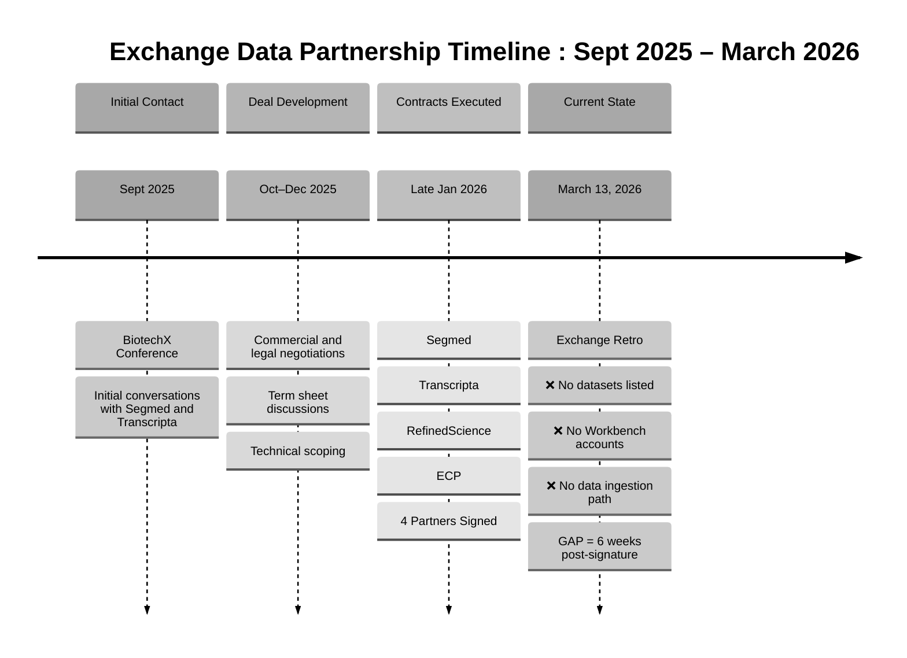

# McKinsey-Style Timeline Graphic: Exchange Partnership Retrospective

## Format 1: Mermaid Diagram (For Professional Rendering)



---

## Format 2: McKinsey Box-and-Arrow Diagram

```
┌─────────────────────────────────────────────────────────────────────────────┐
│                    EXCHANGE DATA PARTNERSHIP TIMELINE                        │
│                         Sept 2025 – March 2026                              │
└─────────────────────────────────────────────────────────────────────────────┘


┌────────────────────────┐
│   SEPT 2025            │
│   ─────────────        │
│   BiotechX Conference  │
│                        │
│   Initial Contact:     │
│   • Segmed             │
│   • Transcripta        │
└────────────┬───────────┘
             │
             │ (Initial conversations)
             ▼
┌────────────────────────┐
│   OCT–DEC 2025         │
│   ──────────────       │
│   Deal Development     │
│                        │
│   Activities:          │
│   • Commercial terms   │
│   • Legal negotiations │
│   • Technical scoping  │
└────────────┬───────────┘
             │
             │ (Negotiation & alignment)
             ▼
┌────────────────────────┐
│   LATE JAN 2026        │
│   ───────────────      │
│   Contracts Executed   │
│                        │
│   Partners Signed:     │
│   ✓ Segmed             │
│   ✓ Transcripta        │
│   ✓ RefinedScience     │
│   ✓ ECP                │
└────────────┬───────────┘
             │
             │ (6 weeks elapsed)
             ▼
┌─────────────────────────────────────────────┐
│   MARCH 13, 2026                            │
│   ────────────────                          │
│   Exchange Retrospective                    │
│                                             │
│   ⚠️  EXECUTION GAP IDENTIFIED:             │
│                                             │
│   ❌ No datasets listed on Exchange         │
│   ❌ No Workbench accounts provisioned      │
│   ❌ No confirmed data ingestion path       │
│                                             │
│   Status: Contracts signed, delivery stalled│
└─────────────────────────────────────────────┘
```

---

## Format 3: PowerPoint-Ready Table Format

Copy this into PowerPoint and format as a SmartArt or table:

```
┌──────────────┬────────────────────────────────────────────────────────┐
│   PHASE      │   MILESTONE / OUTCOME                                  │
├──────────────┼────────────────────────────────────────────────────────┤
│ Sept 2025    │ 🔵 BiotechX Conference                                 │
│ Initial      │ • First contact: Segmed, Transcripta                   │
│ Contact      │ • Opportunity identified                               │
├──────────────┼────────────────────────────────────────────────────────┤
│ Oct–Dec 2025 │ 🔵 Deal Development Phase                              │
│ Negotiation  │ • Commercial terms negotiated                          │
│              │ • Legal review and alignment                           │
│              │ • Technical requirements scoped                        │
├──────────────┼────────────────────────────────────────────────────────┤
│ Late Jan 2026│ ✅ Contracts Executed                                  │
│ Signature    │ Partners signed:                                       │
│              │ • Segmed                                               │
│              │ • Transcripta                                          │
│              │ • RefinedScience                                       │
│              │ • ECP                                                  │
├──────────────┼────────────────────────────────────────────────────────┤
│ March 13 2026│ ⚠️  EXECUTION GAP (6 weeks post-signature)             │
│ Current State│ Retrospective findings:                                │
│              │ ❌ No datasets listed on Exchange                      │
│              │ ❌ No Workbench accounts provisioned                   │
│              │ ❌ No confirmed data ingestion path                    │
│              │                                                        │
│              │ Contracts ≠ Delivery                                   │
└──────────────┴────────────────────────────────────────────────────────┘
```

---

## Format 4: McKinsey "Waterfall" Style (Horizontal Timeline)

```
SEPT 2025          OCT–DEC 2025           LATE JAN 2026          MARCH 13, 2026
─────────          ────────────           ─────────────          ──────────────

┌──────────┐       ┌──────────┐           ┌──────────┐           ┌──────────┐
│ BiotechX │  ───> │   Deal   │  ───────> │Contracts │  ───────> │ Exchange │
│Conference│       │  Develop │           │ Executed │           │   Retro  │
└──────────┘       └──────────┘           └──────────┘           └──────────┘

Initial            Commercial &           4 Partners            Current State:
Contact:           Legal Negotiation      Signed:               
• Segmed                                  • Segmed              ❌ No datasets
• Transcripta                             • Transcripta         ❌ No accounts
                                          • RefinedScience      ❌ No ingestion
                                          • ECP                 
                                                                GAP = 6 weeks


├─────────────────────── 6 MONTHS ────────────────────────────┤
         Deal Cycle                    │
                                       │
                              ┌────────┴────────┐
                              │  EXECUTION GAP   │
                              │   (Unaddressed)  │
                              └──────────────────┘
```

---

## Format 5: McKinsey "So What?" Slide Layout

For a full PowerPoint slide with title, visual, and takeaway:

```
┌─────────────────────────────────────────────────────────────────────────────┐
│                                                                             │
│  Exchange Data Partnerships: 6-Week Execution Gap Post-Signature           │
│  ──────────────────────────────────────────────────────────────────────     │
│                                                                             │
│  Timeline: Sept 2025 – March 2026                                          │
│                                                                             │
│  ┌────────────┐      ┌────────────┐      ┌────────────┐      ┌──────────┐│
│  │ Sept 2025  │ ───> │ Oct–Dec    │ ───> │ Late Jan   │ ───> │ March 13 ││
│  │            │      │    2025    │      │    2026    │      │   2026   ││
│  └────────────┘      └────────────┘      └────────────┘      └──────────┘│
│                                                                             │
│  BiotechX Conf       Deal Development    Contracts Executed  Exchange Retro│
│  Initial contact     • Commercial terms  4 partners signed:  Current state: │
│  • Segmed            • Legal alignment   • Segmed            ❌ No datasets │
│  • Transcripta       • Tech scoping      • Transcripta       ❌ No accounts │
│                                          • RefinedScience    ❌ No ingestion│
│                                          • ECP                              │
│                                                                             │
│  ─────────────────────────────────────────────────────────────────────     │
│                                                                             │
│  KEY INSIGHT:                                                               │
│  Contracts signed in late January, but 6 weeks later (mid-March):          │
│  zero operational delivery. Signing ≠ onboarding.                          │
│                                                                             │
│  IMPLICATION:                                                               │
│  Post-signature execution path undefined. Partners waiting on Verily        │
│  to provision infrastructure and define data ingestion workflow.            │
│                                                                             │
└─────────────────────────────────────────────────────────────────────────────┘
```

---

## Format 6: PowerPoint SmartArt Instructions

**To create this in PowerPoint:**

1. Insert > SmartArt > Process > "Basic Process" or "Chevron Process"
2. Add 4 boxes with these labels:

   **Box 1:** Sept 2025 | BiotechX Conference | Initial Contact
   
   **Box 2:** Oct–Dec 2025 | Deal Development | Negotiations
   
   **Box 3:** Late Jan 2026 | Contracts Executed | 4 Partners Signed
   
   **Box 4:** March 13, 2026 | Exchange Retro | ⚠️ Execution Gap

3. Format:
   - Boxes 1-3: Blue/Gray fill (#0066CC or #5B9BD5)
   - Box 4: Red/Orange fill (#C00000 or #FF6B6B) to highlight gap
   
4. Add text box below Box 4:
   ```
   GAP IDENTIFIED:
   ❌ No datasets listed on Exchange
   ❌ No Workbench accounts provisioned
   ❌ No confirmed data ingestion path
   ```

5. Apply McKinsey color scheme:
   - Primary: Navy (#003366) or Steel Blue (#5B9BD5)
   - Accent: Orange (#FF6B35) for warnings
   - Text: Dark Gray (#333333)

---

## Format 7: Slide Deck Text (Copy-Paste Ready)

**Slide Title:**
Exchange Data Partnerships: Timeline & Execution Gap Analysis

**Subtitle:**
Sept 2025 – March 2026 Retrospective

**Body Content:**

**TIMELINE**

**Sept 2025** – BiotechX Conference
• Initial conversations with Segmed and Transcripta
• Partnership opportunity identified

**Oct–Dec 2025** – Deal Development
• Commercial and legal negotiations
• Technical scoping and alignment

**Late Jan 2026** – Contracts Executed
• 4 partners signed: Segmed, Transcripta, RefinedScience, ECP
• Legal commitments in place

**March 13, 2026** – Exchange Retrospective (Current State)
• Timeline: 6 weeks post-signature
• **EXECUTION GAP IDENTIFIED:**
  ❌ No datasets listed on Exchange
  ❌ No Workbench accounts provisioned
  ❌ No confirmed data ingestion path

**Key Takeaway:**
Contracts signed ≠ operational delivery. Post-signature execution undefined.

---

## Color Palette (McKinsey Standard)

**Primary Colors:**
- Navy Blue: #003366
- Steel Blue: #5B9BD5
- Light Gray: #D9D9D9

**Accent Colors:**
- Warning Orange: #FF6B35
- Success Green: #28A745
- Error Red: #C00000

**Text:**
- Primary: #333333
- Secondary: #666666

---

## Recommended Slide Layout

**Option A: Horizontal Timeline (Preferred)**
- Clean left-to-right flow
- Emphasizes time progression
- Gap box in contrasting color (orange/red)

**Option B: Vertical Funnel**
- Top: Initial contact (wide)
- Middle: Negotiation (medium)
- Bottom: Execution gap (narrow, red)
- Shows narrowing from activity to delivery

**Option C: Two-Column Compare**
- Left column: "What Was Delivered" (contracts)
- Right column: "What Wasn't Delivered" (operational readiness)
- Visual contrast highlights gap

---

## Usage Instructions

1. **For Mermaid:** Copy code to Mermaid Live Editor, export as SVG/PNG
2. **For PowerPoint:** Use SmartArt or paste ASCII table and format
3. **For Google Slides:** Import Mermaid PNG or recreate with shapes
4. **For Keynote:** Use timeline template or manual shape arrangement

---

## File Status

**Formats Provided:** 7 (Mermaid, ASCII boxes, table, waterfall, "So What?" slide, SmartArt instructions, text)
**Style:** McKinsey consulting presentation standard
**Purpose:** Exchange retrospective slide deck
**Key Message:** Execution gap between contract signature and operational delivery
