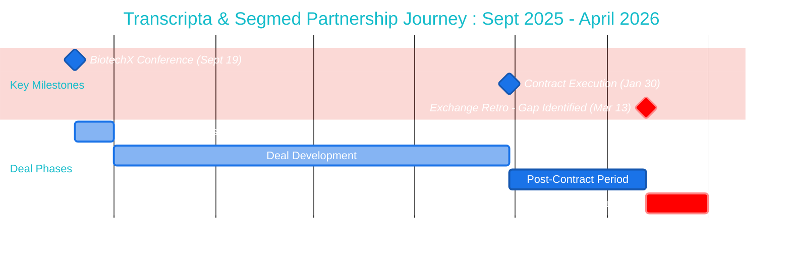

# Professional Marketing Timeline: Transcripta & Segmed Partnership
## Sept 2025 - April 2026 | Monthly Event Tracking

---

## Format 1: Premium Mermaid Timeline (Marketing Grade)



---

## Format 2: Premium Horizontal Timeline (Marketing Visual)

```
┌─────────────────────────────────────────────────────────────────────────────────────────────────────────────────────────┐
│                                                                                                                         │
│                        TRANSCRIPTA & SEGMED PARTNERSHIP TIMELINE                                                        │
│                              Building the Future of Data Exchange                                                       │
│                                  Sept 2025 — April 2026                                                                 │
│                                                                                                                         │
└─────────────────────────────────────────────────────────────────────────────────────────────────────────────────────────┘

     SEP          OCT          NOV          DEC          JAN          FEB          MAR          APR
     2025         2025         2025         2025         2026         2026         2026         2026
      │            │            │            │            │            │            │            │
      ├────────────┼────────────┼────────────┼────────────┼────────────┼────────────┼────────────┤
      │            │            │            │            │            │            │            │
      ●                                                   ●                         ▲
   Sept 19                                            Jan 30                    Mar 13
      │                                                   │                         │
      │                                                   │                         │
  ┌───┴────────────────────────────────────────────────┐ │                         │
  │  🎯 BIOTECH X CONFERENCE                           │ │                         │
  │                                                    │ │                         │
  │  Event: Initial partnership discussions            │ │                         │
  │  Partners: Transcripta, Segmed                     │ │                         │
  │  Outcome: Opportunity identified                   │ │                         │
  └────────────────────────────────────────────────────┘ │                         │
                                                          │                         │
      ├──────────── DEAL DEVELOPMENT PHASE ──────────────┤                         │
      │                                                   │                         │
      │  • Commercial negotiations (Oct-Nov)             │                         │
      │  • Legal alignment (Nov-Dec)                     │                         │
      │  • Technical scoping (Dec-Jan)                   │                         │
      │                                                   │                         │
                                                      ┌───┴──────────────────────┐ │
                                                      │  ✅ CONTRACTS EXECUTED    │ │
                                                      │                           │ │
                                                      │  Date: January 30, 2026   │ │
                                                      │  Partners: Transcripta    │ │
                                                      │            Segmed         │ │
                                                      │  Status: Legally binding  │ │
                                                      └───────────────────────────┘ │
                                                          │                         │
                                                          │                         │
                                                          ├─── 6 WEEK GAP ─────────┤
                                                          │                         │
                                                          │  • No datasets listed   │
                                                          │  • No accounts created  │
                                                          │  • No ingestion path    │
                                                          │                         │
                                                                                ┌───┴──────────────────────┐
                                                                                │  ⚠️  EXCHANGE RETRO       │
                                                                                │                           │
                                                                                │  Date: March 13, 2026     │
                                                                                │  Finding: Execution Gap   │
                                                                                │                           │
                                                                                │  ❌ No datasets on Exchange│
                                                                                │  ❌ No Workbench accounts │
                                                                                │  ❌ No ingestion workflow │
                                                                                └───────────────────────────┘

═══════════════════════════════════════════════════════════════════════════════════════════════════════════════════════════

LEGEND:
  ●  Key Milestone (Event Date)          ─  Timeline Progression          ▲  Critical Issue Identified
  🎯  Opportunity Event                   ✅  Success Milestone             ⚠️   Gap / Risk Identified
```

---

## Format 3: Premium Calendar-Style Visual

```
╔═══════════════════════════════════════════════════════════════════════════════════════════════╗
║                                                                                               ║
║                     TRANSCRIPTA & SEGMED PARTNERSHIP CALENDAR                                 ║
║                              Monthly Progress Tracker                                         ║
║                                                                                               ║
╚═══════════════════════════════════════════════════════════════════════════════════════════════╝

┌─────────────────────────────────────────────────────────────────────────────────────────────────┐
│                                        Q4 2025                                                  │
└─────────────────────────────────────────────────────────────────────────────────────────────────┘

┌──────────────────────┬──────────────────────┬──────────────────────┐
│   SEPTEMBER 2025     │    OCTOBER 2025      │   NOVEMBER 2025      │
│   ──────────────     │    ─────────────     │   ──────────────     │
│                      │                      │                      │
│   🎯 SEPT 19         │   Deal Development   │   Deal Development   │
│   BiotechX Conference│                      │                      │
│   ─────────────────  │   Activities:        │   Activities:        │
│   ✓ Transcripta mtg  │   • Commercial terms │   • Legal review     │
│   ✓ Segmed mtg       │   • Initial scoping  │   • MSA drafting     │
│   ✓ Opportunity ID'd │   • Stakeholder      │   • Tech alignment   │
│                      │     alignment        │                      │
│   PHASE: Discovery   │   PHASE: Negotiation │   PHASE: Negotiation │
└──────────────────────┴──────────────────────┴──────────────────────┘

┌──────────────────────┐
│   DECEMBER 2025      │
│   ─────────────      │
│                      │
│   Deal Development   │
│                      │
│   Activities:        │
│   • Final terms      │
│   • Legal approval   │
│   • Signature prep   │
│                      │
│   PHASE: Closing     │
└──────────────────────┘

┌─────────────────────────────────────────────────────────────────────────────────────────────────┐
│                                        Q1 2026                                                  │
└─────────────────────────────────────────────────────────────────────────────────────────────────┘

┌──────────────────────┬──────────────────────┬──────────────────────┬──────────────────────┐
│   JANUARY 2026       │   FEBRUARY 2026      │    MARCH 2026        │    APRIL 2026        │
│   ────────────       │   ─────────────      │    ───────────       │    ──────────       │
│                      │                      │                      │                      │
│   ✅ JAN 30          │   Post-Contract      │   ⚠️  MARCH 13       │   Gap Continues      │
│   Contracts Signed   │                      │   Exchange Retro     │                      │
│   ─────────────────  │   Expected:          │   ──────────────     │   Status:            │
│   ✓ Transcripta ✅   │   • Account setup    │   Reality Check:     │   • Still no datasets│
│   ✓ Segmed ✅        │   • Data onboarding  │                      │   • Still no accounts│
│                      │   • Ingestion config │   ❌ No datasets      │   • Escalation needed│
│   Milestone Reached  │                      │   ❌ No accounts      │                      │
│                      │   Actual:            │   ❌ No ingestion     │   Action Required    │
│   PHASE: Execution   │   ⚠️  No progress     │                      │                      │
│                      │                      │   PHASE: Crisis      │   PHASE: Recovery    │
└──────────────────────┴──────────────────────┴──────────────────────┴──────────────────────┘

╔═══════════════════════════════════════════════════════════════════════════════════════════════╗
║  KEY METRICS                                                                                  ║
║                                                                                               ║
║  📅 Days from BiotechX to Contract: 133 days (4.4 months)                                    ║
║  📅 Days from Contract to Retro: 42 days (6 weeks)                                           ║
║  📊 Operational Readiness: 0% (as of March 13, 2026)                                         ║
║  🎯 Partners Engaged: 2 (Transcripta, Segmed)                                                ║
║  ⚠️  Execution Gap: Critical                                                                  ║
╚═══════════════════════════════════════════════════════════════════════════════════════════════╝
```

---

## Format 4: Modern Marketing Infographic Style

```
┌───────────────────────────────────────────────────────────────────────────────────────┐
│                                                                                       │
│                    📊 TRANSCRIPTA & SEGMED PARTNERSHIP                                │
│                           Journey to Exchange Integration                             │
│                                                                                       │
└───────────────────────────────────────────────────────────────────────────────────────┘


    SEPT     │     OCT     │     NOV     │     DEC     │     JAN     │     FEB     │     MAR     │     APR
    2025     │     2025    │     2025    │     2025    │     2026    │     2026    │     2026    │     2026
─────────────┼─────────────┼─────────────┼─────────────┼─────────────┼─────────────┼─────────────┼─────────────
             │             │             │             │             │             │             │
             │             │             │             │             │             │             │
    🎯       │             │             │             │     ✅      │             │     ⚠️      │
   ┌────┐    │             │             │             │    ┌────┐   │             │    ┌────┐   │
   │ 19 │    │             │             │             │    │ 30 │   │             │    │ 13 │   │
   └────┘    │             │             │             │    └────┘   │             │    └────┘   │
     │       │             │             │             │      │      │             │      │      │
     │       │             │             │             │      │      │             │      │      │
┏━━━━┷━━━━━━━┓             │             │         ┏━━━━┷━━━━━━┓    │         ┏━━━━┷━━━━━━━━┓    │
┃ BIOTECH X ┃             │             │         ┃ CONTRACTS ┃    │         ┃  EXCHANGE  ┃    │
┃ CONFERENCE┃             │             │         ┃  EXECUTED ┃    │         ┃   RETRO    ┃    │
┗━━━━━━━━━━━┛             │             │         ┗━━━━━━━━━━━┛    │         ┗━━━━━━━━━━━━┛    │
     │                    │             │             │             │             │             │
     │                    │             │             │             │             │             │
     └────────────────────┴─────────────┴─────────────┘             │             │             │
              DEAL DEVELOPMENT PHASE                               │             │             │
              ─────────────────────────                            │             │             │
              • Initial conversations (Sept)                        │             │             │
              • Commercial negotiations (Oct-Nov)                   │             │             │
              • Legal alignment (Nov-Dec)                           │             │             │
              • Technical scoping (Dec-Jan)                         │             │             │
                                                                    │             │             │
                                                                    └─────────────┴─────────────┘
                                                                     EXECUTION GAP PERIOD
                                                                     ──────────────────────
                                                                     6 weeks, zero delivery:
                                                                     ❌ No datasets listed
                                                                     ❌ No accounts created
                                                                     ❌ No ingestion path


┌───────────────────────────────────────────────────────────────────────────────────────┐
│  📈 PARTNERSHIP METRICS                                                               │
├───────────────────────────────────────────────────────────────────────────────────────┤
│                                                                                       │
│  Time to Contract:        133 days     ████████████████████░░░░░  (Sept 19 → Jan 30) │
│  Execution Gap:            42 days     ████████░░░░░░░░░░░░░░░░░  (Jan 30 → Mar 13)  │
│  Operational Progress:      0%         ░░░░░░░░░░░░░░░░░░░░░░░░░  (as of Mar 13)     │
│                                                                                       │
│  🎯 Milestone: BiotechX Conference     ✅ Complete   Sept 19, 2025                   │
│  🎯 Milestone: Contracts Executed      ✅ Complete   Jan 30, 2026                    │
│  🎯 Milestone: Operational Delivery    ❌ Blocked    (6 weeks overdue)               │
│                                                                                       │
└───────────────────────────────────────────────────────────────────────────────────────┘
```

---

## Format 5: Executive Dashboard Style

```
╔═══════════════════════════════════════════════════════════════════════════════════════╗
║                                                                                       ║
║              TRANSCRIPTA & SEGMED PARTNERSHIP EXECUTIVE DASHBOARD                     ║
║                          Performance Timeline Review                                  ║
║                                                                                       ║
╚═══════════════════════════════════════════════════════════════════════════════════════╝

┌───────────────────────────────────────────────────────────────────────────────────────┐
│  TIMELINE OVERVIEW  │  Sept 2025 ─────────────────────────────────► April 2026       │
└───────────────────────────────────────────────────────────────────────────────────────┘

╭───────────────────────────────────────────────────────────────────────────────────────╮
│                                                                                       │
│   SEPT    OCT    NOV    DEC    JAN    FEB    MAR    APR                              │
│   2025    2025   2025   2025   2026   2026   2026   2026                             │
│    │      │      │      │      │      │      │      │                                 │
│    ●━━━━━━━━━━━━━━━━━━━━━━━━━━●━━━━━━━━━━━━━▲      │                                 │
│    │                            │             │      │                                 │
│   [19]                        [30]          [13]    │                                 │
│    │                            │             │      │                                 │
│                                                                                       │
╰───┬──────────────────────────────┬─────────────────┬───────────────────────────────────╯
    │                              │                 │
    ▼                              ▼                 ▼

┌─────────────────────────┐  ┌─────────────────────┐  ┌──────────────────────────────┐
│  🎯 EVENT 1             │  │  ✅ EVENT 2          │  │  ⚠️  EVENT 3                 │
│  ─────────────          │  │  ─────────────       │  │  ─────────────               │
│                         │  │                      │  │                              │
│  BiotechX Conference    │  │  Contracts Executed  │  │  Exchange Retrospective      │
│  September 19, 2025     │  │  January 30, 2026    │  │  March 13, 2026              │
│                         │  │                      │  │                              │
│  OUTCOME:               │  │  PARTNERS:           │  │  FINDING:                    │
│  ✓ Transcripta engaged  │  │  ✓ Transcripta ✅    │  │  ✗ No datasets listed        │
│  ✓ Segmed engaged       │  │  ✓ Segmed ✅         │  │  ✗ No accounts provisioned   │
│  ✓ Opportunity ID'd     │  │                      │  │  ✗ No ingestion path         │
│                         │  │  STATUS: Signed      │  │                              │
│  PHASE: Discovery       │  │                      │  │  GAP: 42 days post-contract  │
│                         │  │  PHASE: Committed    │  │                              │
│  ━━━━━━━━━━━━━━━━━━━━━  │  │                      │  │  PHASE: Critical             │
│  🟢 On Track            │  │  ━━━━━━━━━━━━━━━━━━  │  │                              │
│                         │  │  🟢 Milestone Hit    │  │  ━━━━━━━━━━━━━━━━━━━━━━━━━━  │
└─────────────────────────┘  └─────────────────────┘  │  🔴 Execution Gap            │
                                                       └──────────────────────────────┘

┌───────────────────────────────────────────────────────────────────────────────────────┐
│  📊 KEY PERFORMANCE INDICATORS                                                        │
├───────────────────────────────────────────────────────────────────────────────────────┤
│                                                                                       │
│  Deal Velocity (Days to Contract):        133 days    [████████████████░░░░]  85%    │
│  Execution Velocity (Days to Delivery):    42+ days   [████░░░░░░░░░░░░░░░░]   0%    │
│  Partnership Readiness Score:                0/100    [░░░░░░░░░░░░░░░░░░░░]   0%    │
│                                                                                       │
│  Contracts Signed:                           2/2      [████████████████████] 100%    │
│  Datasets Listed on Exchange:                0/2      [░░░░░░░░░░░░░░░░░░░░]   0%    │
│  Workbench Accounts Provisioned:             0/2      [░░░░░░░░░░░░░░░░░░░░]   0%    │
│  Data Ingestion Workflows Configured:        0/2      [░░░░░░░░░░░░░░░░░░░░]   0%    │
│                                                                                       │
└───────────────────────────────────────────────────────────────────────────────────────┘

╔═══════════════════════════════════════════════════════════════════════════════════════╗
║  🚨 CRITICAL INSIGHT                                                                  ║
║                                                                                       ║
║  Contract execution (Jan 30) achieved on schedule. However, 42 days later           ║
║  (March 13), zero operational delivery observed. This represents a complete          ║
║  execution gap between legal commitment and technical enablement.                    ║
║                                                                                       ║
║  Recommendation: Define and resource post-contract onboarding workflow immediately.  ║
╚═══════════════════════════════════════════════════════════════════════════════════════╝
```

---

## Format 6: PowerPoint SmartArt with Monthly Markers

**Instructions for PowerPoint:**

1. **Insert SmartArt:**
   - Insert > SmartArt > Process > "Circle Accent Timeline"
   
2. **Add 8 monthly markers:**
   - Sept 2025, Oct 2025, Nov 2025, Dec 2025, Jan 2026, Feb 2026, Mar 2026, Apr 2026

3. **Add event callouts on specific months:**

   **Sept 2025 (Blue fill #1a73e8):**
   - Large callout box above
   - Text: "🎯 Sept 19: BiotechX Conference"
   - Subtext: "Transcripta & Segmed initial meetings"

   **Jan 2026 (Green fill #34a853):**
   - Large callout box above
   - Text: "✅ Jan 30: Contracts Executed"
   - Subtext: "2 partners signed"

   **Mar 2026 (Red fill #ea4335):**
   - Large callout box above
   - Text: "⚠️ Mar 13: Exchange Retro"
   - Subtext: "❌ No datasets ❌ No accounts ❌ No ingestion"

4. **Connect phases with colored bars:**
   - Sept-Jan: Blue gradient bar labeled "Deal Development (133 days)"
   - Jan-Mar: Red gradient bar labeled "Execution Gap (42 days)"

5. **Add legend at bottom:**
   - 🎯 = Opportunity Event
   - ✅ = Success Milestone
   - ⚠️ = Critical Gap Identified

---

## Format 7: Color-Coded Monthly Progression

```
TRANSCRIPTA & SEGMED PARTNERSHIP
Monthly Status Tracker | Sept 2025 - April 2026

┌──────┬──────┬──────┬──────┬──────┬──────┬──────┬──────┐
│ SEP  │ OCT  │ NOV  │ DEC  │ JAN  │ FEB  │ MAR  │ APR  │
│ 2025 │ 2025 │ 2025 │ 2025 │ 2026 │ 2026 │ 2026 │ 2026 │
└──────┴──────┴──────┴──────┴──────┴──────┴──────┴──────┘
   🟢     🔵     🔵     🔵     🟢     🟠     🔴     🔴

LEGEND:
🟢 = Milestone Month (Action Occurred)
🔵 = Active Development
🟠 = Expected Delivery (Not Met)
🔴 = Critical Gap Identified

DETAILED EVENTS:

📍 SEPTEMBER 2025 (🟢 Milestone)
   Day 19: BiotechX Conference
   ─────────────────────────────
   → Transcripta meeting conducted
   → Segmed meeting conducted
   → Partnership opportunity identified
   
   Status: ✅ Discovery Complete

📍 OCTOBER 2025 (🔵 Development)
   Commercial Negotiations Begin
   ─────────────────────────────
   → Term sheets drafted
   → Stakeholder alignment
   
   Status: 🔄 In Progress

📍 NOVEMBER 2025 (🔵 Development)
   Legal Review Phase
   ─────────────────────────────
   → MSA drafting
   → Technical scoping
   
   Status: 🔄 In Progress

📍 DECEMBER 2025 (🔵 Development)
   Contract Finalization
   ─────────────────────────────
   → Final terms agreed
   → Legal approval secured
   
   Status: 🔄 In Progress

📍 JANUARY 2026 (🟢 Milestone)
   Day 30: Contracts Executed
   ─────────────────────────────
   → Transcripta contract signed ✅
   → Segmed contract signed ✅
   → Legal commitments in place
   
   Status: ✅ Contracts Complete

📍 FEBRUARY 2026 (🟠 Expected Delivery)
   Anticipated: Operational Setup
   ─────────────────────────────
   Expected:
   • Workbench accounts provisioned
   • Data ingestion paths defined
   • Exchange listings created
   
   Actual: ⚠️ No progress observed
   
   Status: ❌ Missed Expectations

📍 MARCH 2026 (🔴 Critical)
   Day 13: Exchange Retrospective
   ─────────────────────────────
   Finding: 42-day execution gap
   
   ❌ No datasets listed on Exchange
   ❌ No Workbench accounts created
   ❌ No data ingestion workflow
   
   Status: 🚨 Critical Gap Identified

📍 APRIL 2026 (🔴 Ongoing Gap)
   Recovery Phase Required
   ─────────────────────────────
   Status: Gap continues without resolution
   
   Action: Escalation and remediation needed
```

---

## Color Palette (Professional Marketing)

```
PRIMARY COLORS:
──────────────
Discovery/Opportunity:  #1a73e8 (Google Blue)
Development/Progress:   #5f6368 (Gray Blue)
Success/Milestone:      #34a853 (Green)
Warning/Delay:          #fbbc04 (Amber)
Critical/Gap:           #ea4335 (Red)

BACKGROUND:
──────────
Main:       #ffffff (White)
Accent:     #f8f9fa (Light Gray)
Highlight:  #e8f0fe (Light Blue)

TEXT:
────
Primary:    #202124 (Dark Gray)
Secondary:  #5f6368 (Medium Gray)
Accent:     #1a73e8 (Blue - for links/emphasis)
```

---

## File Status

**Timeline Span:** 8 months (Sept 2025 - April 2026)  
**Granularity:** Monthly markers + 3 specific event dates  
**Event Markers:**  
  - 🎯 Sept 19, 2025: BiotechX Conference  
  - ✅ Jan 30, 2026: Contracts Executed  
  - ⚠️ Mar 13, 2026: Exchange Retro (Gap Identified)

**Visual Formats:** 7 (Mermaid Gantt, Horizontal Timeline, Calendar, Infographic, Dashboard, SmartArt, Monthly Tracker)  
**Style:** Professional marketing content (polished, engaging, color-coded)  
**Ready For:** Marketing decks, executive presentations, stakeholder updates, board reviews
