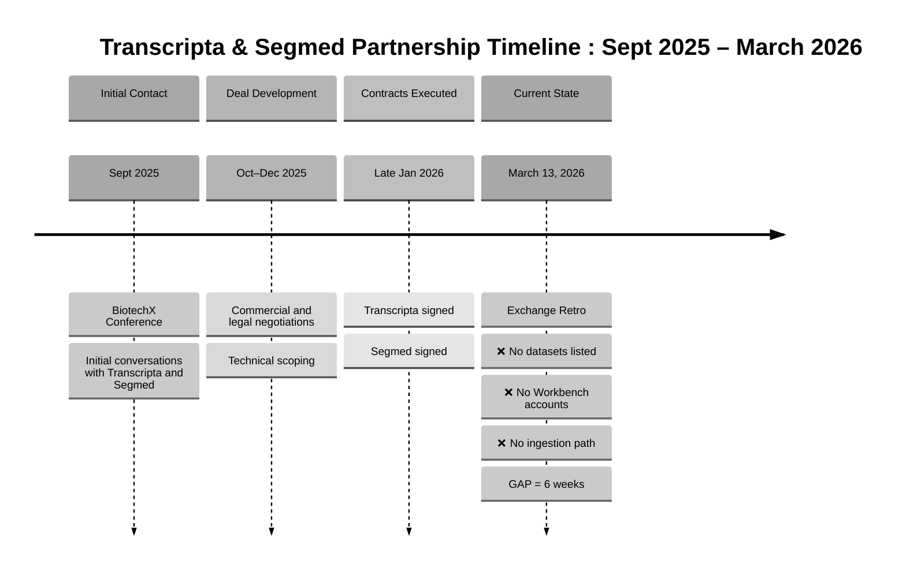

# Simplified Timeline: Transcripta & Segmed Partnership

## Format 1: Mermaid Diagram (Professional Rendering)



---

## Format 2: Clean McKinsey Box Diagram

```
┌─────────────────────────────────────────────────────────────────────────────┐
│              TRANSCRIPTA & SEGMED PARTNERSHIP TIMELINE                       │
│                       Sept 2025 – March 2026                                │
└─────────────────────────────────────────────────────────────────────────────┘


┌────────────────────────┐
│   SEPT 2025            │
│   ─────────────        │
│   BiotechX Conference  │
│                        │
│   Initial Contact:     │
│   • Transcripta        │
│   • Segmed             │
└────────────┬───────────┘
             │
             ▼
┌────────────────────────┐
│   OCT–DEC 2025         │
│   ──────────────       │
│   Deal Development     │
│                        │
│   • Commercial terms   │
│   • Legal negotiations │
│   • Technical scoping  │
└────────────┬───────────┘
             │
             ▼
┌────────────────────────┐
│   LATE JAN 2026        │
│   ───────────────      │
│   Contracts Executed   │
│                        │
│   ✓ Transcripta        │
│   ✓ Segmed             │
└────────────┬───────────┘
             │
             │ (6 weeks elapsed)
             ▼
┌─────────────────────────────────────────────┐
│   MARCH 13, 2026                            │
│   ────────────────                          │
│   Exchange Retrospective                    │
│                                             │
│   ⚠️  EXECUTION GAP:                        │
│                                             │
│   ❌ No datasets listed on Exchange         │
│   ❌ No Workbench accounts provisioned      │
│   ❌ No confirmed data ingestion path       │
└─────────────────────────────────────────────┘
```

---

## Format 3: Horizontal Timeline (PowerPoint-Ready)

```
SEPT 2025          OCT–DEC 2025           LATE JAN 2026          MARCH 13, 2026
─────────          ────────────           ─────────────          ──────────────

┌──────────┐       ┌──────────┐           ┌──────────┐           ┌──────────┐
│ BiotechX │  ───> │   Deal   │  ───────> │Contracts │  ───────> │ Exchange │
│Conference│       │  Develop │           │ Executed │           │   Retro  │
└──────────┘       └──────────┘           └──────────┘           └──────────┘

Initial            Negotiations           Partners Signed:       Current State:
Contact:                                  • Transcripta          
• Transcripta                             • Segmed               ❌ No datasets
• Segmed                                                         ❌ No accounts
                                                                 ❌ No ingestion

                                                                 GAP = 6 weeks


├─────────────────────── 6 MONTHS ────────────────────────────┤
         Deal Development Cycle            │
                                          │
                                 ┌────────┴────────┐
                                 │  EXECUTION GAP   │
                                 └──────────────────┘
```

---

## Format 4: Simple Table (Copy-Paste to PowerPoint)

```
┌──────────────┬────────────────────────────────────────────────────────┐
│   PHASE      │   MILESTONE / OUTCOME                                  │
├──────────────┼────────────────────────────────────────────────────────┤
│ Sept 2025    │ 🔵 BiotechX Conference                                 │
│              │ • Initial conversations: Transcripta, Segmed           │
├──────────────┼────────────────────────────────────────────────────────┤
│ Oct–Dec 2025 │ 🔵 Deal Development                                    │
│              │ • Commercial and legal negotiations                    │
│              │ • Technical scoping                                    │
├──────────────┼────────────────────────────────────────────────────────┤
│ Late Jan 2026│ ✅ Contracts Executed                                  │
│              │ • Transcripta signed                                   │
│              │ • Segmed signed                                        │
├──────────────┼────────────────────────────────────────────────────────┤
│ March 13 2026│ ⚠️  EXECUTION GAP (6 weeks post-signature)             │
│              │ ❌ No datasets listed on Exchange                      │
│              │ ❌ No Workbench accounts provisioned                   │
│              │ ❌ No confirmed data ingestion path                    │
└──────────────┴────────────────────────────────────────────────────────┘
```

---

## Format 5: PowerPoint SmartArt Instructions

**To create in PowerPoint:**

1. Insert > SmartArt > Process > "Basic Timeline" or "Chevron Process"

2. Add 4 boxes:

   **Box 1 (Blue):**  
   Sept 2025  
   BiotechX Conference  
   Transcripta & Segmed

   **Box 2 (Blue):**  
   Oct–Dec 2025  
   Deal Development  
   Negotiations

   **Box 3 (Green):**  
   Late Jan 2026  
   Contracts Executed  
   2 Partners Signed

   **Box 4 (Red/Orange):**  
   March 13, 2026  
   Exchange Retro  
   ⚠️ Execution Gap

3. Add text box below final box:
   ```
   ❌ No datasets listed
   ❌ No Workbench accounts
   ❌ No ingestion path
   ```

---

## Format 6: Slide Deck Text (Copy-Paste Ready)

**Slide Title:**  
Transcripta & Segmed Partnership: Timeline Analysis

**Subtitle:**  
Sept 2025 – March 2026

---

**TIMELINE**

**Sept 2025** – BiotechX Conference  
• Initial conversations with Transcripta and Segmed  
• Partnership opportunity identified

**Oct–Dec 2025** – Deal Development  
• Commercial and legal negotiations  
• Technical scoping and alignment

**Late Jan 2026** – Contracts Executed  
• Transcripta signed  
• Segmed signed

**March 13, 2026** – Exchange Retrospective  
• **6 weeks post-signature**  
• **EXECUTION GAP IDENTIFIED:**

  ❌ No datasets listed on Exchange  
  ❌ No Workbench accounts provisioned  
  ❌ No confirmed data ingestion path

---

**Key Takeaway:**  
Two partners contracted, zero operational delivery after 6 weeks.

---

## Format 7: Ultra-Simple 3-Box Version

```
┌─────────────────┐      ┌─────────────────┐      ┌─────────────────┐
│  SEPT 2025      │      │  LATE JAN 2026  │      │  MARCH 13 2026  │
│                 │      │                 │      │                 │
│  BiotechX Conf  │ ───> │  Contracts      │ ───> │  Exchange Retro │
│                 │      │  Signed         │      │                 │
│  • Transcripta  │      │                 │      │  ⚠️ GAP:        │
│  • Segmed       │      │  • Transcripta  │      │  No delivery    │
│                 │      │  • Segmed       │      │  after 6 weeks  │
└─────────────────┘      └─────────────────┘      └─────────────────┘

   Initial Contact        Legal Commitment         Operational Reality
```

---

## Format 8: Single-Line Summary (For Executive Overview)

```
Sept 2025: Transcripta & Segmed conversations begin
    ↓
Oct–Dec 2025: Deal development
    ↓
Late Jan 2026: Contracts executed
    ↓
March 13, 2026: 6-week gap, zero delivery (no datasets, accounts, or ingestion)
```

---

## Color Recommendations (McKinsey Standard)

**Boxes 1-2 (Contact & Development):**  
- Fill: Light Blue (#D6EAF8) or Light Gray (#E8E8E8)  
- Border: Navy (#003366)

**Box 3 (Contracts):**  
- Fill: Light Green (#D5F4E6) or Steel Blue (#5B9BD5)  
- Border: Dark Green (#28A745)

**Box 4 (Execution Gap):**  
- Fill: Light Orange (#FFE6CC) or Light Red (#FFCCCC)  
- Border: Warning Orange (#FF6B35) or Error Red (#C00000)

---

## Key Message (For Slide Notes)

**Setup:** Transcripta and Segmed identified as Exchange data partners at BiotechX Conference (Sept 2025). Deals developed Oct–Dec, contracts signed Late Jan 2026.

**Gap:** Six weeks post-signature (March 13, 2026), zero operational progress:
- No datasets listed on Exchange
- No Workbench accounts provisioned for partners
- No confirmed data ingestion workflow

**Implication:** Contract execution does not guarantee operational readiness. Post-signature onboarding undefined.

---

## Recommended Layout

**Best for Executive Deck:**  
Format 3 (Horizontal Timeline) or Format 7 (Ultra-Simple 3-Box)

**Best for Detailed Review:**  
Format 2 (McKinsey Box Diagram) or Format 4 (Table)

**Best for Quick Creation:**  
Format 5 (PowerPoint SmartArt Instructions)

---

## File Status

**Partners:** Transcripta & Segmed only  
**Formats:** 8 (Mermaid, boxes, horizontal, table, SmartArt, text, 3-box, single-line)  
**Style:** McKinsey consulting standard  
**Message:** 6-week execution gap post-contract signature  
**Ready for:** PowerPoint, Google Slides, Keynote, executive briefing
